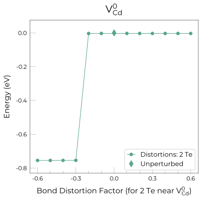
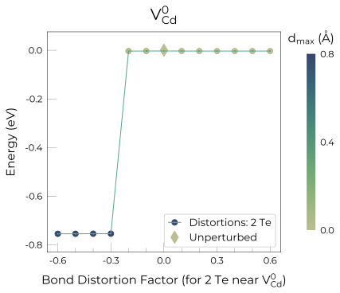

.. _tutorial_analysis:

Analysis & plotting
=====================

Parsing
----------

To parse the final energies of the geometry optimisations for a specific defect, we can simply run the command
:code:`snb-parse` within the defect folder:

.. code:: bash

    $ snb-parse

Alternatively, we can run from a different directory and specify the defect to parse (as well as other options, see
``snb-parse -h``):

.. code:: bash

    $ snb-parse --defect v_Cd_s0_0 --path defects_folder --code FHI-aims

Where ``defects_folder`` is the path to the top level directory containing the defect folder, and is only required if
different from the current directory.

Instead of a single defect, we can parse the results for **all** defects present
in a given/current directory using the ``-a``/``--all`` flag:

.. code:: bash

    $ snb-parse -a

This generates a ``yaml`` file for each defect, mapping each distortion to the
final energy of the relaxed structures (in eV). These files are saved to the
corresponding defect directory (e.g. ``defects_folder/v_Cd_s0_0/v_Cd_s0_0.yaml``).

.. code:: yaml

    distortions:
        -0.6: -187.70
        -0.3: -187.45
        ...
    Unperturbed: -186.70

Analysis
----------
To analyse the structures obtained from the relaxations, we can use ``snb-analyse``.
It will generate ``csv`` files for a given/all defects with the final energies
and structural similarities between the final configurations and a reference one
(by default the undistorted one). Structural similarity is measured with two metrics:
a) the sum of atomic displacements between matched sites and b) the maximum distance
between matched sites. For instance, to analyse the results obtained with ``VASP`` for a specific defect, we can simply
run the command ``snb-analyse`` from within the defect directory:

.. code:: bash

    $ snb-analyse

Again we can alternatively run the command from a different directory and specify which defect to analyse, which code
was used (if not :code:`VASP`) and which reference structure to use (default = ``Unperturbed``):

.. code:: bash

    $ snb-analyse --defect v_Cd_s0_0 --code FHI-aims --path defects_folder --ref_struct -0.4 --verbose

Again if we want to analyse the results for **all** defects present in a given/current directory, we can use the
``-a``/``--all`` flag:

.. code:: bash

    $ snb-analyse -a

.. NOTE::
    Further analysis tools are provided through the python API. These are documented in
    the section :ref:`shakenbreak.analysis <api_analysis>`
    and exemplified in the
    `Analysis section <https://shakenbreak.readthedocs.io/en/latest/ShakeNBreak_Example_Workflow.html#optional-analyse-the-defect-distortions-found-with-snb>`_
    of the Python API tutorial.

Plotting
-----------
Energy lowering distortions can be quickly identified by plotting the final energies
of the relaxed structures versus the distortion factor, using ``snb-plot``.
To plot the results obtained with ``VASP`` for a specific defect, we can simply run the command ``snb-plot`` from within
the defect directory:

.. code:: bash

    $ snb-plot

which will generate a figure like the one below:

..
    data from example_results folder

We can make these plots more informative by adding a colorbar measuring the structural similarity between the
structures, using the ``-cb``/``--colorbar`` flag:

.. code:: bash

    $ snb-plot -cb

..
    data from example_results folder

Again we can alternatively run the command from a different directory and specify which defect to plot, which code
was used (if not :code:`VASP`) and other options (what ``metric`` to use for colorbar etc – see ``snb-plot -h``):

.. code:: bash

    $ snb-plot --defect v_Cd_s0_0 --code FHI-aims --path defects_folder --colorbar -0.4 --metric disp --units meV --verbose

Again if we want to plot the results for **all** defects present in a given/current directory, we can use the
``-a``/``--all`` flag:

.. code:: bash

    $ snb-plot -a

.. TIP::
    See ``snb-plot -h`` or `the CLI docs <https://shakenbreak.readthedocs.io/en/latest/shakenbreak.cli.html#snb-plot>`_
    for details on the options available for this command.

Second round of structure searching
---------------------------------------
After the defects undergoing energy lowering distortions have been identified,
we can test these favourable configurations for the *other charge states of the same defect* -
in case these are favourable for them too and have not been previously identified.
By calling ``snb-regenerate``, the code will perform structure comparisons for all
defects present in the specified/current directory, to determine which distortions
should be tested in other charge states and which have already been found. For the
distortions to test, it will generate additional distortion folders with the
structure and relaxation input files.

For example, if we have the following directory structure

.. code:: bash

    ./
    |--- v_Cd_s0_0/ <-- Neutral Cd vacancy
    |       |--- Unperturbed
    |       |
    |       |--- Bond_Distortion_-30.0% <-- Favourable distortion
    |       |
    |       |--- Bond_Distortion_30.0%
    |       | ...
    |
    |--- v_Cd_s0_-1/ <-- Negatively charged Cd vacancy
            |--- Unperturbed
            | ...
            |--- Bond_Distortion_50% <-- Favourable distortion

and two different energy lowering distortion have been identified for the neutral
(with a distortion of -0.3) and for the negatively charged vacancy
(with a distortion of 0.5), the code below will ensure that these configurations are
indeed different and, if so, generate the input files for both of them.

.. code:: bash

    $ snb-regenerate

As a result, two new distortion folders are generated, with the relaxation input files
for the code specified with the flag ``--code`` (default = :code:`VASP`).

.. code:: bash

    ./
    |--- v_Cd_s0_0/
    |       |--- Unperturbed
    |       |
    |       |--- Bond_Distortion_-30.0% <-- Favourable distortion
    |       |
    |       |--- Bond_Distortion_30.0%
    |       | ...
    |       |--- Bond_Distortion_50.0%_from_-1 <-- Distortion from the -1 charge state
    |
    |--- v_Cd_s0_-1/
            |--- Unperturbed
            | ...
            |--- Bond_Distortion_50% <-- Favourable distortion
            |
            |--- Bond_Distortion_-30.0%_from_0 <-- Distortion from the neutral charge state

.. TIP::
    See ``snb-regenerate -h`` or `the CLI docs <https://shakenbreak.readthedocs.io/en/latest/shakenbreak.cli.html#snb-regenerate>`_
    for details on the options available for this command.

Saving the ground state structures
---------------------------------------

Finally, to continue our defect workflow, we want to save the ground state defect structures to continue our calculations
with these structures. Using the ``snb-groundstate`` command, we can generate a ``Groundstate`` folder for each defect
with its ground state structure.

.. code:: bash

    $ snb-groundstate

The name of the ground state directory and of the structure file can be customised with the
``--directory`` and ``--groundstate_filename`` flags, respectively:

.. code:: bash

    $ snb-groundstate --path ./defects_folder --directory Groundstate --groundstate_filename POSCAR

This command will generate a ``Groundstate`` directory within each defect folder, e.g.:

.. code:: bash

    ./
    |--- v_Cd_s0_0/
    |       |--- Unperturbed
    |       |
    |       |--- Bond_Distortion_-30.0%
    |       |
    |       |--- Bond_Distortion_30.0%
    |       | ...
    |       |--- Groundstate
    |               |--- POSCAR <-- Ground state structure
    |
    |--- v_Cd_s0_-1/
            |--- Unperturbed
            | ...
            |--- Bond_Distortion_50%
            |
            |--- Groundstate
                    |--- POSCAR <-- Ground state structure

.. TIP::
    See ``snb-groundstate -h`` or `the CLI docs <https://shakenbreak.readthedocs.io/en/latest/shakenbreak.cli.html#snb-groundstate>`_
    for details on the options available for this command.

Further Defect Analysis
-------------------------
Once the ground state (and metastable) defect structures have been identified, we will want to compute
their formation energies using our final fully-converged calculation parameters (i.e. plane-wave cutoff
and k-point sampling). This can be done using `doped <https://github.com/SMTG-UCL/doped>`_, manually (not
recommended) or using the other defect codes listed on the
`Code Compatibility <https://shakenbreak.readthedocs.io/en/latest/Code_Compatibility.html>`_ page.

As shown in the `doped <https://github.com/SMTG-UCL/doped>`_ examples and docs, you may want to further
analyse the behaviour and impact on material properties of your defects using advanced defect analysis
codes such as `easyunfold <https://smtg-ucl.github.io/easyunfold/>`_ (to analyse the electronic
structure of defects in your material), `py-sc-fermi <https://py-sc-fermi.readthedocs.io/en/latest/>`_
(to analyse defect concentrations, doping and Fermi level tuning), or
`nonrad <https://nonrad.readthedocs.io/en/latest/>`_/`CarrierCapture.jl <https://wmd-group.github.io/CarrierCapture.jl/dev/>`_
(to analyse non-radiative electron-hole recombination at defects).

.. NOTE::
    Metastable structures can also be important to defect behaviour! This is particularly the case for
    defect/ion migration, electron-hole recombination at defects and non-equilibrium situations such as
    under illumination or ion bombardment. For example, see these papers on the impact of metastable
    defects in CdTe:
    `ACS Energy Lett. 2021, 6, 4, 1392–1398 <https://doi.org/10.1021/acsenergylett.1c00380>`_ and
    `Faraday Discuss. 2022, 239, 339-356 <https://doi.org/10.1039/D2FD00043A>`_.

In particular, symmetry-breaking as a result of structural reconstruction from the initial
(``Unperturbed``) high-symmetry structure can result in an increase in configurational degeneracy for
the defect, which should be accounted for when later computing concentrations and Fermi level position.
These considerations, as well as the importance of metastability and temperature effects for the free
energies (and thus concentrations) for certain defects/systems are discussed in this Tutorial Review
paper: `Imperfections are not 0 K: free energy of point defects in crystals, 10.48550/arXiv.2307.10451 <https://doi.org/10.48550/arXiv.2307.10451>`_.