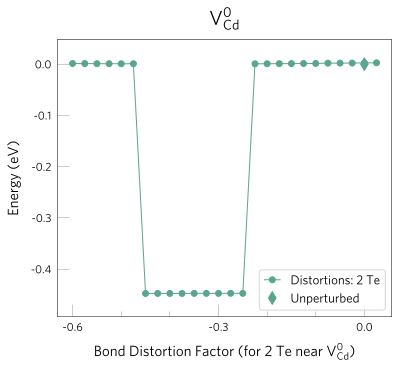
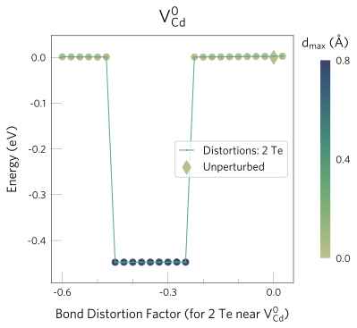

Analysis & plotting
=====================

Parsing
----------

To parse the final energies of the geometry optimisations for a specific defect:

.. code:: bash

    $ snb-parse --code vasp --defect vac_1_Cd_0 --path defects_folder

Where ``defects_folder`` is the path to the top level directory containing the defect folder,
and is only required if different from the current directory.

Instead of a single defect, we can parse the results for **all** defects present
in a given/current directory using:

.. code:: bash

    $ snb-parse --all --code vasp --path defects_folder

This generates a ``yaml`` file for each defect, mapping each distortion to the
final energy of the relaxed structures (in eV). These files are saved to the
corresponding defect directory (e.g. ``defects_folder/vac_1_Cd_0/vac_1_Cd_0.yaml``).

.. code:: yaml

    distortions:
        -0.6: -187.70
        -0.3: -187.45
        ...
    Unperturbed: -186.70

Analysis
----------
To analyse the structures obtained from the relaxations, we can use ``snb-analyse``.
It will generate ``csv`` files for a given/all defects with the final energies
and structural similarities between the final configurations and a reference one
(by default the undistorted one). Structural similarity is measured as the sum
of atomic displacements and the maximum distance between matched sites. For instance,
to analyse the results obtained with ``VASP`` for the defect ``vac_1_Cd_0``, we can use:

.. code:: bash

    $ snb-analyse --defect vac_1_Cd_0 --code vasp --path defects_folder

Further analysis tools are provided through the python API. These are documented in
the section `shakenbreak.analysis <https://shakenbreak.readthedocs.io/en/latest/shakenbreak.analysis.html>`_
and exemplified in the
`example notebook <https://github.com/SMTG-UCL/ShakeNBreak/blob/main/tutorials/ShakeNBreak_Example_Workflow.ipynb>`_
(Section 5: Analyse defect distortions).

Plotting
-----------
Energy lowering distortions can be quickly identified by plotting the final energies
of the relaxed structures versus the distortion factor, using ``snb-plot``:

.. code:: bash

    $ snb-plot --defect vac_1_Cd_0 --path defects_folder

which will generate a figure like the one below:

We can make these plots more informative by adding a colorbar measuring the structural
similarity between the structures:

.. code:: bash

    $ snb-plot --defect vac_1_Cd_0 --path defects_folder --colorbar

Second round of structure searching
---------------------------------------
After the defects undergoing energy lowering distortions have been identified,
we can test these favourable configurations for the *other charge states of the same defect* -
in case these are favourable for them too and have not been previously identified.
By calling ``snb-regenerate``, the code will perform structure comparisons for all
defects present in the specified/current directory, to determine which distortions
should be tested in other charge states and which have already been found. For the
distortions to test, it will generate additional distortion folders with the
structure and relaxation input files.

For example, if we have the following directory structure

.. code:: bash

    ./
    |--- vac_1_Cd_0/ <-- Neutral Cd vacancy
    |       |--- Unperturbed
    |       |
    |       |--- Bond_Distortion_-30.0% <-- Favourable distortion
    |       |
    |       |--- Bond_Distortion_30.0%
    |       | ...
    |
    |--- vac_1_Cd_-1/ <-- Negatively charged Cd vacancy
            |--- Unperturbed
            | ...
            |--- Bond_Distortion_50% <-- Favourable distortion

and two different energy lowering distortion have been identified for the neutral
(with a distortion of -0.3) and for the negatively charged vacancy
(with a distortion of 0.5), the code below will ensure that these configurations are
indeed different and, if so, generate the input files for both of them.

.. code:: bash

    $ snb-regenerate --path ./defects_folder --code vasp

As a result, two new distortion folders are generated, with the relaxation input files
for the code specified with the flag ``--code``.

.. code:: bash

    ./
    |--- vac_1_Cd_0/
    |       |--- Unperturbed
    |       |
    |       |--- Bond_Distortion_-30.0% <-- Favourable distortion
    |       |
    |       |--- Bond_Distortion_30.0%
    |       | ...
    |       |--- Bond_Distortion_50.0%_from_-1 <-- Distortion from the -1 charge state
    |
    |--- vac_1_Cd_-1/
            |--- Unperturbed
            | ...
            |--- Bond_Distortion_50% <-- Favourable distortion
            |
            |--- Bond_Distortion_-30.0%_from_0 <-- Distortion from the neutral charge state

