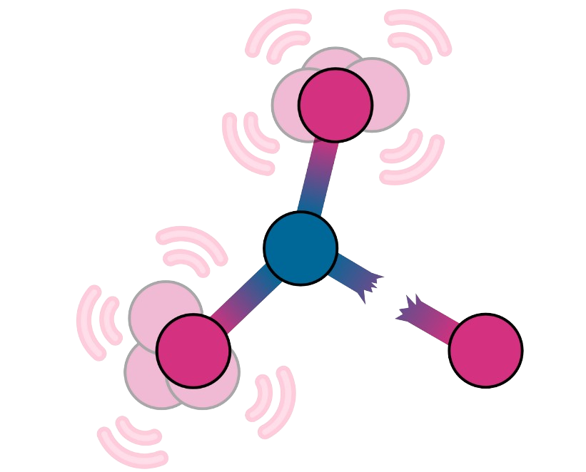

.. shakenbreak documentation master file, created by
   sphinx-quickstart on Tue Aug  2 22:08:04 2022.
   You can adapt this file completely to your liking, but it should at least
   contain the root `toctree` directive.

.. image:: https://github.com/SMTG-UCL/ShakeNBreak/actions/workflows/build_and_test.yml/badge.svg
 :target: https://github.com/SMTG-UCL/ShakeNBreak/actions

.. image:: https://readthedocs.org/projects/shakenbreak/badge/?version=latest&style=flat
 :target: https://shakenbreak.readthedocs.io/en/latest/

.. image:: https://img.shields.io/badge/arXiv-2207.09862-b31b1b.svg
 :target: https://arxiv.org/abs/2207.09862

.. image:: https://img.shields.io/pypi/v/shakenbreak
 :target: https://pypi.org/project/shakenbreak

.. image:: https://joss.theoj.org/papers/6545bcc1a0439b16360ace684ac5aa25/status.svg
 :target: https://joss.theoj.org/papers/6545bcc1a0439b16360ace684ac5aa25

.. image:: https://img.shields.io/pypi/dm/shakenbreak
 :target: https://shakenbreak.readthedocs.io/en/latest/
|

Welcome to ShakeNBreak!
=======================================

``ShakeNBreak`` (``SnB``) is a defect structure-searching method employing
chemically-guided bond distortions to locate ground-state and metastable
structures of point defects in solid materials. |logo|

Main features include:

1. Defect structure generation:

   * Automatic generation of distorted structures for input defects
   * Optionally, input file generation for geometry optimisation with several codes (``VASP``, ``CP2K``, ``Quantum-Espresso``, ``CASTEP`` & ``FHI-aims``)
2. Analysis:

   * Parsing of geometry relaxation results
   * Plotting of final energies versus distortion to demonstrate what energy-lowering reconstructions have been identified
   * Coordination & bonding analysis to investigate the physico-chemical factors driving an energy-lowering distortion
   * Magnetisation analysis (currently only supported for ``VASP``)

The code currently supports ``VASP``, ``CP2K``, ``Quantum-Espresso``, ``CASTEP`` and ``FHI-aims``.
Code contributions to support additional solid-state packages are welcome!

|
.. image:: SnB_Supercell_Schematic_PES_2sec_Compressed.gif
   :width: 800px
|

Installation
========================

ShakeNBreak can be installed using ``pip``:

.. code:: bash

  pip install --user shakenbreak

If using ``VASP``, in order for ``ShakeNBreak`` to automatically generate the pseudopotential
input files (``POTCARs``), your local ``VASP`` pseudopotential directory must be set in the ``pymatgen``
configuration file ``$HOME/.pmgrc.yaml`` as follows:

.. code:: bash

  PMG_VASP_PSP_DIR: <Path to VASP pseudopotential top directory>

Within your ``VASP`` pseudopotential top directory, you should have a folder named ``POT_GGA_PAW_PBE``
which contains the ``POTCAR.X(.gz)`` files (in this case for PBE ``POTCARs``). More details given
`here <https://pymatgen.org/installation.html#potcar-setup>`_.

Developer installation
------------------------

For development work, ``ShakeNBreak`` can also be installed from a copy of the source directory:

1. Download ``ShakeNBreak`` source code using the command:

   .. code:: bash

      git clone https://github.com/SMTG-UCL/ShakeNBreak

2. Navigate to root directory:

   .. code:: bash

      cd ShakeNBreak

3. Install the code, using the command:

   .. code:: bash

      pip install -e .

   This command tries to obtain the required packages and their dependencies and install them automatically.

Usage
========================

Python API
----------------

``ShakeNBreak`` can be used through a Python API, as exemplified in the `SnB Python API Tutorial <https://shakenbreak.readthedocs.io/en/latest/ShakeNBreak_Example_Workflow.html>`_.

Command line interface
-------------------------

Alternatively, the code can be used via the command line.

|
.. image:: SnB_CLI.gif
   :width: 800px
|

The functions provided include:

* ``snb-generate``: Generate distorted structures for a given defect
* ``snb-generate_all``: Generate distorted structures for all defects present int the specified/current directory
* ``snb-run``: Submit geometry relaxations to the HPC scheduler
* ``snb-parse``: Parse the results of the geometry relaxations and write them to a ``yaml`` file
* ``snb-analyse``: Generate ``csv`` files with energies and structural differences between the final configurations
* ``snb-plot``: Generate plots of energy vs distortion, with the option to include a colorbar to quantify structural differences
* ``snb-regenerate``: Identify defect species undergoing energy-lowering distortions and test these distortions for the other charge states of the defect
* ``snb-groundstate``: Save the ground state structures to a ``Groundstate`` directory for continuation runs

More information about each function and its inputs/outputs are available from the
:ref:`CLI section of the docs <cli_commands>` or using ``-h`` help option (e.g. ``snb -h``).

We recommend at least looking through the :ref:`Tutorials <tutorials>` when first starting to use ``ShakeNBreak``, to
familiarise yourself with the full functionality and workflow.

Code Compatibility
========================

:code:`ShakeNBreak` is built to natively function using :code:`pymatgen` :code:`Defect` objects (`docs available here <https://materialsproject.github.io/pymatgen-analysis-defects/>`_) and be compatible with the most recent version of :code:`pymatgen`. If you are receiving :code:`pymatgen`-related errors when using :code:`ShakeNBreak`, you may need to update :code:`pymatgen` and/or :code:`ShakeNBreak`, which can be done with:

.. code:: bash

   pip install --upgrade pymatgen shakenbreak

:code:`ShakeNBreak` can take :code:`pymatgen` :code:`Defect` objects as input (to then generate the trial distorted
structures), **but also** can take in :code:`pymatgen` :code:`Structure` objects, :code:`doped` defect dictionaries or
structure files (e.g. :code:`POSCAR`\s for :code:`VASP`) as inputs. As such, it should be compatible with any defect code
(such as `doped <https://github.com/SMTG-UCL/doped>`_, `pydefect <https://github.com/kumagai-group/pydefect>`_,
`PyCDT <https://github.com/mbkumar/pycdt>`_, `PyLada <https://github.com/pylada/pylada-defects>`_,
`DASP <http://hzwtech.com/files/software/DASP/htmlEnglish/index.html>`_, `Spinney <https://gitlab.com/Marrigoni/spinney/-/tree/master>`_,
`DefAP <https://github.com/DefAP/defap>`_, `PyDEF <https://github.com/PyDEF2/PyDEF-2.0>`_...) that generates these files.
Please let us know if you have any issues with compatibility, or if you would like to see any additional features added to :code:`ShakeNBreak` to make it more compatible with your code.

Acknowledgements
========================

``ShakeNBreak`` has benefitted from feedback from many members of the Walsh and Scanlon research groups who have
used / are using it in their work, including Adair Nicolson, Xinwei Wang, Katarina Brlec, Joe Willis,
Zhenzhu Li, Jiayi Cen, Lavan Ganeshkumar, Daniel Sykes, Luisa Herring-Rodriguez, Alex Squires, Sabrine Hachmiouane and
Chris Savory.
Code to identify defect species from input supercell structures was written based on the implementation
in `PyCDT <https://doi.org/10.1016/j.cpc.2018.01.004>`_ by Broberg *et al.*

Contributing
========================

Bugs reports, feature requests and questions
----------------------------------------------

Please use the `Issue Tracker <https://github.com/SMTG-UCL/ShakeNBreak/issues>`_
to report bugs or request new features.

Contributions to extend this package are very welcome! Please use the
`"Fork and Pull" <https://docs.github.com/en/get-started/quickstart/contributing-to-projects>`_
workflow to do so and follow the `PEP8 <https://peps.python.org/pep-0008/>`_ style guidelines.

See the `Contributing Documentation <https://shakenbreak.readthedocs.io/en/latest/Contributing.html>`_ for detailed instructions.

Tests
----------------------------------------------

Unit tests are in the ``tests`` directory and can be run from the top directory using
`unittest <https://docs.python.org/3/library/unittest.html>`_.
Automatic testing is run on the master and develop branches using Github Actions. Please
run tests and add new tests for any new features whenever submitting pull requests.

License
========================

``ShakeNBreak`` is made available under the MIT License.

Requirements
========================

``ShakeNBreak`` is compatible with Python 3.8 & 3.9 and requires the following open-source python packages:

* `Pymatgen <https://pymatgen.org/>`_
* `Ase <https://wiki.fysik.dtu.dk/ase/>`_
* `Hiphive <https://hiphive.materialsmodeling.org/>`_
* `Numpy <https://numpy.org/>`_
* `Matplotlib <https://matplotlib.org/>`_
* `Pandas <https://pandas.pydata.org/>`_
* `Seaborn <https://seaborn.pydata.org/>`_
* `Monty <https://pythonhosted.org/monty/index.html>`_
* `Click <https://click.palletsprojects.com/en/8.1.x/>`_

.. toctree::
   :hidden:
   :maxdepth: 4

   Installation
   Python API <modules>
   Tutorials
   Tips
   Code_Compatibility
   Contributing
